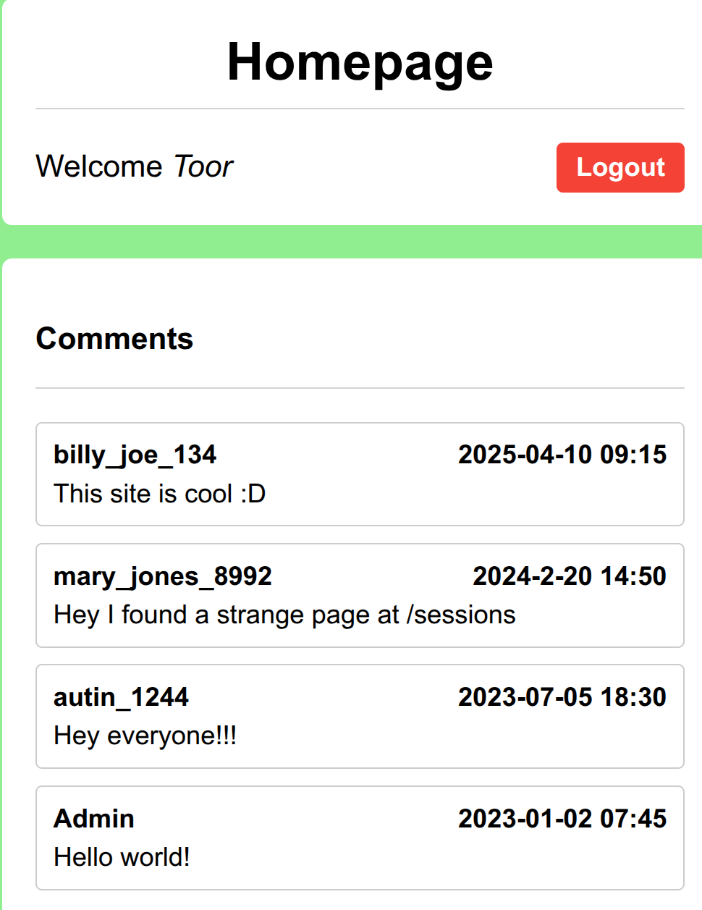

# Old Sessions

## Oppgave

```text
Proper session timeout controls are critical for securing user accounts. 
If a user logs in on a public or shared computer but doesn’t explicitly log out 
(instead simply closing the browser tab), 
and session expiration dates are misconfigured, 
the session may remain active indefinitely.

This then allows an attacker using the same browser later to access 
the user’s account without needing credentials, 
exploiting the fact that sessions never expire and remain authenticated.
```

**Hint**

```text
Do you know how to use the web inspector?
Where are cookies stored?
```

## Løsning

Vi åpner nettsiden i nettleseren og undersøker siden.
Det er en standard innlogging med feltene «Username» og «Password» samt knappene «Login» og «Register».
Vi prøver forskjellige brukernavn og passord, men ingenting fungerer.
Vi ser på kildekoden, men finner ikke noe spennende der heller.
Vi åpner «Developer Tools» i Brave, men under «Application» finner vi ingenting spennende i «Cookies» eller andre steder.

**Lager en konto**

Vi registrerer en ny konto og bruker den gode gamle kombinasjonen `Toor` / `root`.
Når vi logger inn, ser vi at noen har lagt inn kommentarer, hvorav én er spesielt interessant.



`mary_jones_8992` er inne på noe. Vi går derfor til:

http://dolphin-cove.picoctf.net:xxxx/sessions

Der finner vi følgende informasjon:

```text
1) session:-eRbLUDboNpWbyvvohr7E3ZMjpjf1ehJ41_LomDyHHE, {'_permanent': True, 'key': 'admin'}

2) session:x8Cta7jHI8t5Ld0fa0pk6MXQT0EkVXv1Jgz43tjFNCk, {'_permanent': True, 'key': 'Toor'}
```

## Resultat

Vi tar med oss denne informasjonen og går tilbake til «Homepage» mens vi fortsatt er logget inn.

I «Web Inspector» går vi til «Application» og endrer verdien på session-cookien vår til `-eRbLUDboNpWbyvvohr7E3ZMjpjf1ehJ41_LomDyHHE`.

Nå har vi plutselig byttet konto til `Admin`, og flagget vårt blir vist:

```text
picoCTF{RESULTAT}
```

## Hva har jeg lært

Jeg har funnet ut at det finnes noe som heter en HttpOnly-cookie. Den kan ikke leses fra «Console» i «Web Inspector», og det er heller ikke mulig å redigere den på denne måten.
